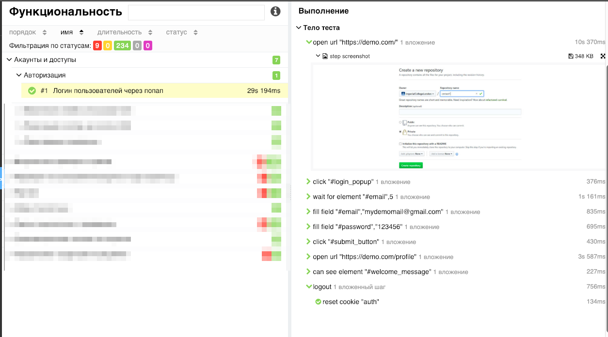

# Allure Codeception Adapter Fork

This is **fork** of [official Codeception adapter for Allure Framework](https://github.com/allure-framework/allure-codeception).


## Installation and Usage
In order to use this adapter you need to add a new dependency to your **composer.json** file:
```
{
  "require": {
    "mvadzim/allure-codeception": "dev-master"
  },
  "repositories": [
    {
      "type": "git",
      "url": "https://github.com/mvadzim/allure-codeception"
    }
  ]
}
```
To enable this adapter in Codeception tests simply put it in "enabled" extensions section of **codeception.yml**:
```yaml
extensions:
    enabled:
        - Yandex\Allure\Adapter\AllureAdapter
    config:
        Yandex\Allure\Adapter\AllureAdapter:
            deletePreviousResults: true
            outputDirectory: allure-results
            ignoredAnnotations:
                - env
                - dataprovider
            enabledAttach:
                - stepScreenshot
                - stepBrowserLog # Not work in firefox, phpbrowser
                - failedStepPageSource
                - visualceptionScreenshot # Attach actual.png, expected.png, diff.png for screen-diff-plugin
            stepScreenshotIgnored:
                - 'grab*'
                - '*cookie'
                - '*api*'
            visualceptionTestGroups: # Enable screen-diff-plugin for groups 
                - visual
```

 
## Note

Форк делался для себя и под свои запросы, из-за этого не нужно надеятся на его стабильность и безбажность даже для базовых вариантов использования.

##### Изменения:
* Исправление вывода тестов сделанных через датапровайдер
* Своя логика именования тестов, шагов. Для датапровайдера название берется с  $example['WantTo']
* Подключение [screen-diff-plugin](https://github.com/allure-framework/allure2/tree/master/plugins/screen-diff-plugin) для [VisualCeption](https://github.com/mvadzim/VisualCeption)
* Автоматическое добавление скриншотов для каждого шага теста.
* Автоматическое добавление скриншота и html страницы упавшего теста
* Вывод подшагов для step object
* Пометка упавшего шага красным значком
 
               
 